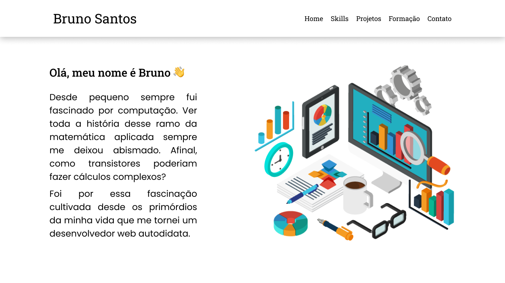

# :books: Meu Portfolio Pessoal

## :star: Iniciando

Simplesmente vá até [o site](https://bruno-slv.github.io?Portfolio) e confira meus trabalhos mais recentes :stuck_out_tongue:.

## :ledger: Seções do site

* **Home** - Onde falo um pouco da minha vida pessoal e visão
* **Skills** - Discorre sobre as ferramentas que domino
* **Projetos** - Lista meus últimos projetos
* **Formação** - Enumera os cursos e conhecimentos que já adquiri
* **Contato** - Seção com minhas informações de contato (linkedin, facebook, etc), além do campo para contato do footer

## :pencil2: Uso 

O documento foi desenvolvido para mostrar minhas competências como desenvolvedor front-end em uma página estática, a fim de compilar meus principais projetos pessoais em um só lugar.

## 💻 Software usado

Para desenvolver o projeto foram usadas as ferramentas:

* Figma - Prototipagem Inicial
* JavasScript - Linguagem de Scripts
* EmailJS - Lib usada para mandar emails sem a necessidade de um código back-end
* HTML5 - Semântica da página
* CSS3 - Estilos em Cascata
* Visual Studio Code - Editor de Texto
* Chrome Dev. Tools - Debugger

## 🤝 Contribuindo

Todos são bem vindos para contribuir com o projeto, bem como ramificar este repositório para uso posterior.

## :page_facing_up: Licença

[MIT](https://opensource.org/licenses/MIT)